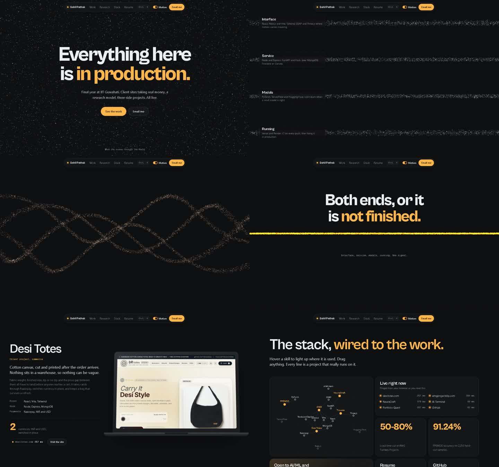

# Sahil Pathak

Portfolio of an AI/ML and full-stack engineer. Dark, one amber signal. A WebGL particle field reacts to the cursor, then on scroll splits into four strands (Interface, Service, Models, Running), braids them and fuses them into one beam: "Both ends, or it is not finished." The same fusion is the research: four signals, one gated answer.



**The work**, all live

| | |
|---|---|
| [desitotes.com](https://desitotes.com) | Desi Totes, made-to-order cotton canvas totes. Client |
| [amgprojectsllp.com](https://amgprojectsllp.com) | AMG Turnkey Projects LLP, construction and interiors, Pune. Client |
| [ai-compiler-eta.vercel.app](https://ai-compiler-eta.vercel.app) | NeuraCraft, a browser code editor |
| [ai-chat-bot-gcar.vercel.app](https://ai-chat-bot-gcar.vercel.app) | AI Terminal |
| [gamifyport.vercel.app](https://gamifyport.vercel.app) | Portfolio Quest, a pixel-art portfolio you walk around |

## The chapters

| Chapter | What it does |
|---|---|
| Hero | Particle field (Three.js shader, 14k points) that parts around the cursor |
| Braid | Pinned, scrubbed: the field becomes four labelled strands, a braid, then one beam |
| Desi Totes, AMG | Pinned split: a CSS 3D laptop lid opens on scroll onto the real site, stats count up, live status from the API |
| X-ray | A lens over the live site shows what is underneath: Razorpay, the cart that survives a refresh, INR and USD, the APIs behind AMG |
| PPEMDD | Switch any of the four signals off; the gate reweights the rest and signals keep flowing |
| Stack | A draggable skill constellation (d3-force): click a project to pull its stack in, click a skill to see where it runs, filter by layer. Only real skill-to-project links |
| Also live | The three side projects as a horizontal accordion |
| Resume | Cards that stack as you scroll; the full CV is `cv.html`, the PDF in `public/assets` |

Plus a Cmd/Ctrl+K command menu (cmdk), Lenis smooth scroll on GSAP's ticker, magnetic buttons, and a Motion switch in the nav. Motion follows `prefers-reduced-motion`; reduced-motion visitors get a calm version and a notice offering full motion. `?motion` in the URL forces it on.

## Running it

A React front end over a Node and Express API, built with Vite.

```bash
npm install
npm run dev        # the site and the API together, http://localhost:4500
npm run build      # production build into dist/ (index.html and cv.html)
npm run preview    # serve the production build, API included
```

On Vercel the front end is the Vite build and the API is one serverless function (`api/index.js`) running the same Express app.

### The API

| Route | What it does |
|---|---|
| `GET /api/status` | Fetches every live project from the server and times it; cached at the edge for a minute. The page's live readings and the Check again button use it |
| `POST /api/contact` | Sends an email form. Needs `RESEND_API_KEY` set on Vercel; without it the caller is told to fall back to mailto. Not used by the current page, kept for later |
| `GET /api/health` | Whether the API is up, and whether mail is configured |

## What is in here

| Path | What it is |
|---|---|
| `index.html`, `src/main.jsx`, `src/App.jsx` | The React app |
| `src/data.js` | Every fact, link, metric and skill link the page shows, in one place |
| `src/motion.js` | Motion preference, Lenis on the GSAP ticker, the live status store |
| `src/components/SignalField.jsx` | The WebGL particle field and its four states |
| `src/components/` | The chapters, the nav, the command menu |
| `src/styles.css` | The whole design system |
| `cv.html`, `src/styles/site.css` | The resume as plain, printable HTML, with its own stylesheet |
| `server/`, `api/index.js` | The Express app, the status checker and the Vercel function |
| `public/work/` | Stills of the live sites |
| `public/assets/` | The resume's fonts and PDF |
| `docs/spec.md` | The design spec for this version |
| `legacy/` | The first React portfolio, kept intact |
| `scrollcraft/` | Brief and browser test scripts from the previous (desk) version |
